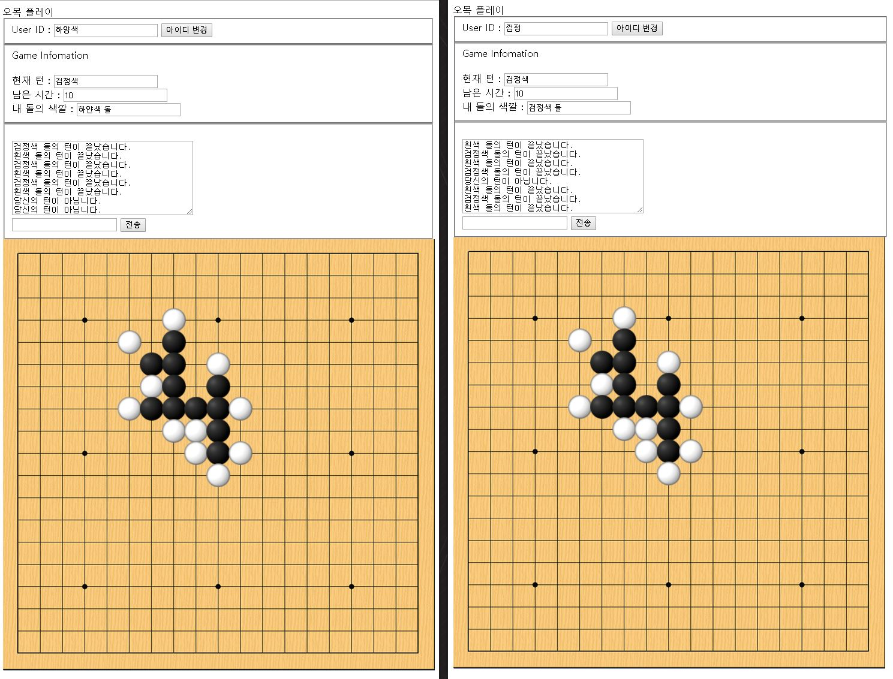

#Web Omok
#daeheum.comedu.kr
===============
제작자 : 김대흠 
프로그램 개발 언어 : Javascript / Nodejs 
게임 구동 환경 : IE 9 이상 / 크롬 / 파이어폭스 등

#게임 실행 방법
================
1. daeheum.comedu.kr 을 접속한다.  
2. 우측 메뉴 중 Play Omok을 클릭한다.  
3. 랜덤 유저와 매칭한다.
4. 플레이한다.
